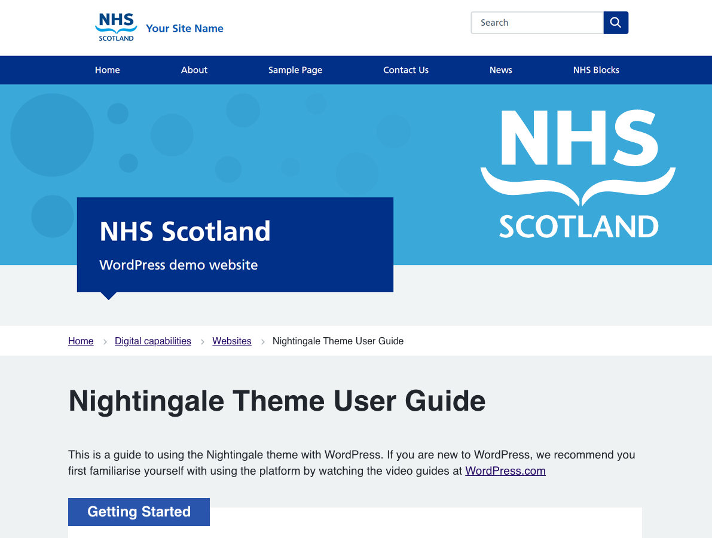

# NHSScotland WordPress Theme
This is a companion child theme that can be used in conjuction with the NHS Leadership Academy Nightingale Theme (https://en-gb.wordpress.org/themes/nightingale/).  
It has been customised to apply NHS Scotland colours, add additional custom templates, and change the font used (due to licensing).

## Usage
- Install the Nightingale Theme - https://en-gb.wordpress.org/themes/nightingale/
- Download the latest copy Nightingale Child from the releases - https://github.com/nhsshow/nightingale-show/releases/latest/download/theme.zip
- Extract this and drop it into `wp-content/themes`. Future updates will not require this.
- Enable the `nightingale-child` theme.

## Thanks
Thanks go to:
- NHS Leadership Academy for the original Nightingale theme - https://github.com/NHSLeadership/nightingale-2-0
- Plugin Update Checker for easy updating a non wp.org theme - https://github.com/YahnisElsts/plugin-update-checker
